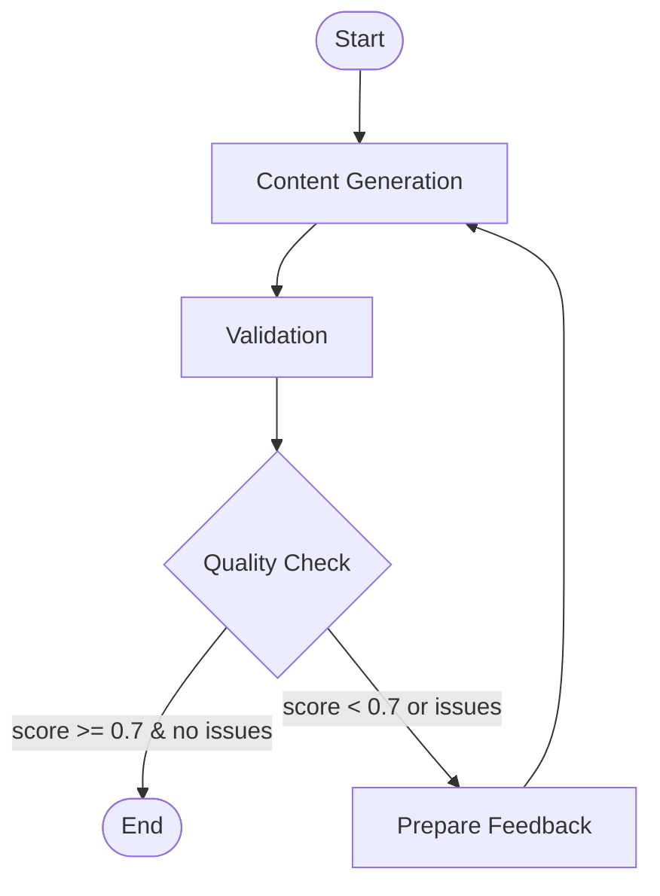

# InteractiveAI - SEO Content Generation Pipeline

An intelligent, LLM-powered pipeline for generating high-quality, SEO-optimized property listing content with comprehensive validation and automatic refinement.

## 🎯 Project Overview

InteractiveAI is a production-ready system that transforms structured property data (JSON) into SEO-optimized HTML content. The pipeline leverages LangGraph for orchestration, OpenAI's GPT models for content generation, and implements a sophisticated multi-layer validation system with automatic retry logic.

### Key Features

- **Structured Content Generation**: Converts property JSON data into SEO-optimized descriptions
- **Multi-Layer Validation**: 4 comprehensive validation categories (structural, linguistic, SEO, JSON consistency)
- **Automatic Refinement**: Up to 3 retry attempts with detailed feedback for quality improvement
- **LLM-Based Consistency Checking**: Validates content accuracy against input data
- **RESTful API**: FastAPI-based backend for integration
- **Interactive UI**: Streamlit interface for easy testing and visualization
- **Production Logging**: Structured logging with rotation and compression + LangSmith monitoring

## 🏗️ Architecture

The system uses a state-based workflow built with LangGraph. See the visual workflow in [workflow_graph.html](workflow_graph.html).

### Pipeline Workflow



**Nodes:**
1. **output_processing**: Generates SEO content using LLM with structured output
2. **validate**: Performs comprehensive 4-layer validation
3. **retry**: Prepares detailed feedback for regeneration (max 3 attempts)

**Retry Logic**: Content is regenerated if validation score < 0.7 or critical issues exist, up to 3 attempts.

## 📋 Content Output Structure

The pipeline generates the following SEO components:

- **Title** (max 60 chars): SEO-optimized page title
- **Meta Description** (max 155 chars): Search engine preview text
- **Headline**: Main property headline
- **Full Description** (500-700 chars): Detailed property description
- **Key Features** (3-5 items): Bullet-point highlights
- **Summary**: Concise property overview
- **Call-to-Action**: Engagement prompt

## ✅ Validation Process

The system implements a sophisticated 4-layer validation framework with weighted scoring:

### 1. Structural Validation (25% weight)

Ensures content meets technical constraints:

- **Title Length**: 10-60 characters (error if >60)
- **Meta Description**: 50-155 characters (error if >155)
- **Full Description**: 500-700 characters (optimal: 600-650)
- **Key Features Count**: 3-5 features required
- **Empty Fields Check**: No null or empty values allowed
- **HTML/XML Tags**: No markup in text fields

**Scoring**: Each violation deducts 0.31 (critical) or 0.1-0.2 (warning) from the score.

### 2. Linguistic Quality (25% weight)

Analyzes text quality and readability:

- **Repetition Detection**: N-gram analysis to identify redundant phrases
- **LLM Phrase Detection**: Flags common AI-generated expressions
  - Multilingual support (English, Spanish, Portuguese, Russian, Turkish)
- **Capitalization Check**: Limits excessive ALL CAPS usage
- **Sentence Length**: Validates appropriate sentence structure

**Example LLM phrases detected** (English):
- "discover", "nestled", "boasting", "unparalleled", "embark", etc.

### 3. SEO Effectiveness (25% weight)

Optimizes content for search engines:

- **Keyword Stuffing Detection**: Flags words appearing >5% of total
- **Call-to-Action (CTA) Validation**: Ensures actionable language
  - Language-specific patterns (e.g., "contact", "schedule", "book")
- **Property Type Keywords**: Validates presence in title (apartment, house, villa, etc.)
- **Location Keywords**: Checks for city/neighborhood in title from input JSON

### 4. JSON Consistency (25% weight)

LLM-powered validation of content accuracy:

Uses a separate GPT-4o instance to verify:

- **Fabricated Features** (critical): No invented amenities or details
- **Incorrect Numbers** (critical): Validates bedrooms, bathrooms, sqft, price
- **Listing Type Match** (critical): Sale vs. rent must match input
- **Language Correctness** (critical): Content matches specified language
- **Missing Important Features** (warning): Flags omitted key amenities
- **Other Inconsistencies** (warning): General accuracy issues

**Consistency Check Process:**
1. Formats all generated content into a single text block
2. Sends to LLM with input JSON for cross-validation
3. Returns structured `ConsistencyCheck` object with specific violations
4. Each critical issue deducts 0.31 from score

### Overall Scoring

- **Final Score**: Weighted average of all 4 categories
- **Pass Threshold**: Score ≥ 0.7 AND zero critical issues
- **Retry Trigger**: Score < 0.7 OR any critical issues present
- **Max Retries**: 3 attempts with detailed feedback

### Validation Output Example

```json
{
  "passed": true,
  "score": 0.85,
  "issues": [],
  "warnings": [
    "Title close to limit: 58/60 chars"
  ],
  "category_scores": {
    "structural": 0.9,
    "linguistic": 0.8,
    "seo": 0.85,
    "json_consistency": 0.85
  }
}
```

## 🚀 Running the Pipeline

### Prerequisites

- Python 3.11+
- UV package manager
- OpenAI API key in `.env` file

### Installation

```bash
# Install dependencies
uv sync
```

### Running the System

The system consists of two components: **API Backend** (FastAPI) and **UI Frontend** (Streamlit).  
You can run them either via Docker or locally.

---

#### Option A: Docker (Recommended)

```bash
docker compose up --build
```

This starts both services:
- **API**: `http://localhost:8001`
- **UI**: `http://localhost:8501`

---

#### Option B: Local Environment

Run both components in separate terminals:

**1. Start the API Backend**

```bash
uv run uvicorn api:app --reload --port 8001
```

**API Endpoints:**
- `GET /health`: Health check
- `POST /generate`: Generate content from JSON

**2. Start the UI Frontend**

```bash
uv run streamlit run ui.py
```

This launches the Streamlit interface at `http://localhost:8501`

### Using the Interface

1. **Upload JSON**: Use the file uploader or paste JSON directly
2. **Generate**: Click "Generate HTML" button
3. **View Results**: 
   - Live HTML preview of generated content
   - Validation report with scores and issues
4. **Results Saved**: HTML outputs saved to `results/` directory

### Running Programmatically

```python
from main import run_pipeline
import json

# Load input data
with open("example/input_example.json", "r") as f:
    input_json = json.load(f)

# Run pipeline
result = run_pipeline(input_json)

# Access results
html_output = result["formatted_data"]
validation = result["validation"]
retry_count = result["retry_count"]
```

## 📂 Project Structure

```
InteractiveAI/
├── api.py                      # FastAPI REST API
├── ui.py                       # Streamlit web interface
├── main.py                     # Pipeline orchestration
├── content_generation.py       # LLM content generation logic
├── content_validation.py       # 4-layer validation system
├── .env.example                # Example of .env file
├── models.py                   # Pydantic data models
├── Dockerfile                  # Docker image configuration
├── docker-compose.yml          # Docker Compose services
├── pyproject.toml              # Project dependencies (UV/pip)
├── uv.lock                     # Locked dependency versions
├── llm_config/
│   ├── llm_config.py           # LLM configuration
│   ├── llm_prompt.txt          # Generation prompt template
│   └── output_template.py      # HTML template
├── validation_config/
│   ├── valid_config.py         # Validation configuration
│   ├── llm_valid_prompt.txt    # Consistency check prompt
│   └── valid_lang_phrases.py   # Language-specific validation rules
├── utils/
│   ├── file_system.py          # File operations
│   └── analysis.py             # Graph visualization
├── example/
│   ├── input_example.json      # Sample input
│   ├── input_case*.json        # Valid inputs used for normal pipeline operation
│   ├── input_case*_bad.json    # Stress-test inputs with missing information
│   └── example.html            # Sample output
├── results/                    # Generated HTML outputs
├── logs/                       # Application logs
└── workflow_graph.html         # Visual pipeline diagram
```

## 🔧 Configuration

### LLM Settings
- **Generation Model**: GPT-5 (configurable in `llm_config/llm_config.py`)
- **Validation Model**: GPT-4o (configurable in `validation_config/valid_config.py`)
- **Temperature**: 0.7 for generation, 0 for validation
- **Max Retries**: 3 attempts

### Logging
- **Location**: `logs/` directory
- **Rotation**: Daily at midnight
- **Retention**: 30 days
- **Compression**: Automatic ZIP after rotation

## 📊 Input JSON Format

```json
{
  "property_type": "apartment",
  "listing_type": "sale",
  "language": "en",
  "location": {
    "city": "Barcelona",
    "neighborhood": "Eixample"
  },
  "details": {
    "bedrooms": 3,
    "bathrooms": 2,
    "square_meters": 120,
    "price": 450000
  },
  "features": [
    "balcony",
    "elevator",
    "recently renovated"
  ]
}
```

## 📈 Performance

- **Average Generation Time**: 5-10 seconds
- **With 1 Retry**: 10-15 seconds
- **With 3 Retries**: 20-30 seconds
- **Success Rate**: ~95% on first attempt, ~99% with retries

## 🛠️ Technology Stack

- **Orchestration**: LangGraph (state-based workflows)
- **LLM Integration**: LangChain + OpenAI
- **API**: FastAPI
- **UI**: Streamlit
- **Validation**: Custom multi-layer framework
- **Logging**: Loguru
- **Data Models**: Pydantic

## 📝 Example Use Cases

1. **Real Estate Agencies**: Bulk property listing generation
2. **Property Platforms**: API integration for automated descriptions
3. **SEO Content Teams**: Template-based content with quality guarantees
4. **Multilingual Listings**: Support for 5+ languages with localized validation

## 🔍 Quality Guarantees

- ✅ SEO-optimized content lengths
- ✅ No fabricated information
- ✅ Factual accuracy validation
- ✅ Language-appropriate phrasing
- ✅ Clear call-to-action
- ✅ Keyword optimization without stuffing
- ✅ Natural, non-AI-sounding text

## 📄 Assumptions & Future Improvements

Assumptions
- Single-threaded execution; no async or concurrency.
- REST API exposes only a generate endpoint; no status polling or result retrieval endpoints.

Future Improvements
- Introduce async processing or background task execution (e.g., Celery, Redis, asyncio).
- Add job status polling and result retrieval endpoints.
- Set up CI/CD pipeline with automated formatting (Ruff/Black), linting, and tests.
- Add unit/integration tests and coverage reports.

---

**Note**: Ensure your `.env` file contains a valid `OPENAI_API_KEY` before running the pipeline.

